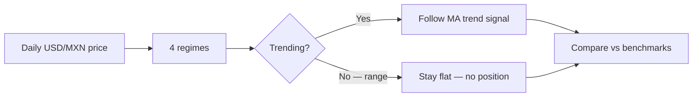

# When Should You Hedge? A Simple Regime Test on USD/MXN

**Author:** Brendan Bowers  
**Date:** 2026-05-30  
**Type:** Research note (not investment advice)

---

## Abstract

I built a small research lab to answer one practical question for treasury and risk teams:

> **Should you adjust your USD/MXN hedge based on market regime — or is it better to stay flat when the market is “range-bound”?**

Using ~20 years of daily FX data, I classified each day into four regimes (trend vs range × high vs low volatility), then tested a simple rule: **follow the trend in trending regimes; go flat in ranging regimes.** I stress-tested that idea with a six-level “research ladder” — from descriptive stats to out-of-sample tests, nine currency pairs, forecast errors, trading costs, and data-snooping controls.

**Bottom line:** The regime story is real for USD/MXN — returns and strategy P&L behave differently across regimes — and the “stay flat in range” rule beats doing nothing out-of-sample on MXN. But it is **not** a price-forecasting model, it **does not** cleanly generalize to every EM pair in every period, and it **does not** survive strict multiple-testing correction after searching across strategies.

---

## 1. The idea in one minute

Most FX hedging programs use a fixed hedge ratio (e.g. 80% of exposure). This project asks whether **when** you hedge matters as much as **how much**.



**Four regimes**

| Regime | Plain English | ~Time in sample |
|--------|---------------|-----------------|
| R1 | Trending + volatile | 36.18% |
| R2 | Trending + calm | 51.14% |
| R3 | Range-bound + volatile | 2.26% |
| R4 | Range-bound + calm | 10.42% |

**Strategy tested (`flat_range`):** Use a simple moving-average trend signal (MA20 vs MA60) **only** in trending regimes (R1/R2). In range regimes (R3/R4), **position = 0**.

**Benchmarks:**
- *Buy and hold* — always long USD/MXN  
- *Random walk* — always flat (zero position). This is the right null for “does timing add value vs doing nothing?”

---

## 2. What I did — the research ladder

I pre-registered six levels of evidence so the project couldn’t “stop when the chart looked good.”

| Level | Question | Method |
|-------|----------|--------|
| **1** | Do returns differ by regime? | Average bps/day, Sharpe, drawdown by regime |
| **2** | Does it work out-of-sample? | Train 2010–18 → test 2019–21; roll forward to 2022–24 and 2025–26 |
| **3** | Is it only MXN? | Same test on 9 G10/EM pairs |
| **4** | Does it forecast prices? | MAE, RMSE, directional accuracy, Diebold–Mariano test |
| **5** | Does it survive costs? | Spreads, slippage, roll, carry assumptions |
| **6** | Did I overfit? | Holdout window, bootstrap Sharpe, White Reality Check |

All code and config live in **BR3N Macro Labs** (`~/fx_regime_lab`). Reproduce with:

```bash
python scripts/run_research_ladder.py --refresh
python scripts/build_publication.py
```

---

## 3. What I found

### Level 1 — Returns differ by regime (USD/MXN)

Spot USD/MXN returns are **not** the same in every regime. Strategy P&L concentrates in **R2 (trend + low vol)**:

| regime | avg_bps_day_flat_range | sharpe_flat_range |
| --- | --- | --- |
| R1_trend_high_vol | 0.03 | 0.005 |
| R2_trend_low_vol | 1.59 | 0.443 |
| R3_range_high_vol | -0.57 | -9.966 |
| R4_range_low_vol | -0.22 | -5.643 |


**Interpretation:** The edge, if any, is about **when not to trade** (sit out range regimes), not about calling every wiggle.

### Level 2 — Out-of-sample on USD/MXN

`flat_range` beat the flat benchmark (random walk) on **all three** pre-declared test windows:

| test_window | flat_range_return_% | flat_range_sharpe | random_walk_sharpe | beats_flat_benchmark |
| --- | --- | --- | --- | --- |
| 2019-01-01..2021-12-31 | 0.42 | 0.075 | 0.0 | True |
| 2022-01-01..2024-12-31 | 10.92 | 0.363 | 0.0 | True |
| 2025-01-01..2026-12-31 | 3.82 | 0.317 | 0.0 | True |


2019–2021 was economically weak (+0.4%, Sharpe 0.08). Stronger periods: 2022–2024 (+10.9%, Sharpe 0.36).

### Level 3 — Other currency pairs

Full-sample Sharpe (`flat_range`):

| ticker | sharpe | total_return_pct | max_drawdown_pct | primary_beats_rw |
| --- | --- | --- | --- | --- |
| USDMXN=X | 0.163 | 28.9 | -32.61 | True |
| USDBRL=X | 0.226 | 62.95 | -41.34 | True |
| USDCOP=X | 0.146 | 22.63 | -41.89 | True |
| USDJPY=X | 0.279 | 59.0 | -21.68 | True |
| EURUSD=X | 0.153 | 21.83 | -24.12 | True |
| USDINR=X | 0.149 | 17.62 | -24.2 | True |
| USDPHP=X | 0.059 | 3.16 | -35.86 | True |
| USDZAR=X | 0.023 | -19.3 | -40.4 | True |
| USDTRY=X | 0.847 | 1107.91 | -36.72 | True |


**Cross-pair OOS:** 59.3% of pair×split cells beat the flat benchmark (16.0/27.0). Only **USD/MXN** and **USD/TRY** beat the benchmark on all three OOS splits.

| ticker | splits_beating_rw | splits_total | all_splits_beat_rw |
| --- | --- | --- | --- |
| EURUSD=X | 2 | 3 | False |
| USDBRL=X | 1 | 3 | False |
| USDCOP=X | 1 | 3 | False |
| USDINR=X | 2 | 3 | False |
| USDJPY=X | 1 | 3 | False |
| USDMXN=X | 3 | 3 | True |
| USDPHP=X | 2 | 3 | False |
| USDTRY=X | 3 | 3 | True |
| USDZAR=X | 1 | 3 | False |


### Level 4 — Not a forecasting model

Forecast errors were **not** better than a random-walk (zero) forecast. Diebold–Mariano p-values ≈ 0.99. **Do not** describe this as “predicting MXN.”

### Level 5 — Economics after frictions

| Cost layer | Total return | Sharpe |
|------------|--------------|--------|
| Base (2 bps turnover) | 28.9% | 0.163 |
| Full economic stack | 2.43% | 0.071 |

Realistic frictions cut cumulative return sharply. Still slightly positive on MXN over 20y, but **not** a high-Sharpe trading strategy.

### Level 6 — Data-snooping

| Check | Result |
|-------|--------|
| Best strategy (full sample) | `r2_only` |
| White Reality Check p-value | 0.628 |
| Survives 5% threshold? | **No** (p > 0.05) |

Searching across `legacy`, `flat_range`, and `r2_only` and picking the best **does not** pass a formal reality check. Treat `r2_only`’s strong in-sample stats with skepticism.

---

## 4. Hypothesis scorecard

| # | Hypothesis | Verdict |
|---|------------|---------|
| H1 | Returns differ across regimes | **Supported** |
| H2 | OOS Sharpe beats flat benchmark on MXN | **Supported** (weak in 2019–21) |
| H3 | Works on ≥50% of EM pairs | **Mixed** — full sample yes; strict OOS no |
| H4 | Better price forecasts than random walk | **Not supported** |
| H5 | Positive after full economic costs | **Weak yes** (2.43%) |
| H7 | White Reality Check | **Not supported** |

---

## 5. Practical takeaway for hedging

**What this supports**
- Regime labels are a useful **risk-management language** for USD/MXN.
- There is evidence that **staying flat in range regimes** avoids churn when trend signals are unreliable.
- Out-of-sample on MXN, the rule did not underperform “do nothing” — and helped in recent windows.

**What this does not support**
- A deployable alpha strategy after realistic costs.
- A universal rule across all EM FX pairs and all periods.
- Better point forecasts of USD/MXN.

**Plain-English policy framing**

> “We don’t use this to predict MXN. We use it to ask: *Is this a trending environment where our hedge should be active, or a range environment where we should avoid over-trading?* On MXN, that distinction shows up in the data. On other pairs, results are mixed.”

---

## 6. Limitations

- Rule-based regimes with fixed thresholds (no ML, no forward curve).
- Yahoo/Stooq daily spot only; no intraday or options.
- Costs and carry are stylized assumptions, not live treasury fills.
- USD/TRY results are dominated by long-run lira depreciation — not comparable to MXN for policy use.
- Holdout window 2025–2026 was evaluated once; do not re-tune parameters after seeing it.

---

## 7. Reproducibility

| Item | Location |
|------|----------|
| Code | `~/fx_regime_lab` |
| Config (pre-registered splits) | `config.yaml` |
| Full ladder output | `reports/research_ladder/` |
| Model card | `reports/model_cards/usdmxn_regime_model.md` |

---

## Disclaimer

This document is **research and risk framing only**. It is **not** investment advice, a trading recommendation, or a substitute for professional treasury, accounting, or regulatory judgment. Past backtests do not guarantee future results.

---

*Generated by BR3N Macro Labs — `build_publication.py`*
